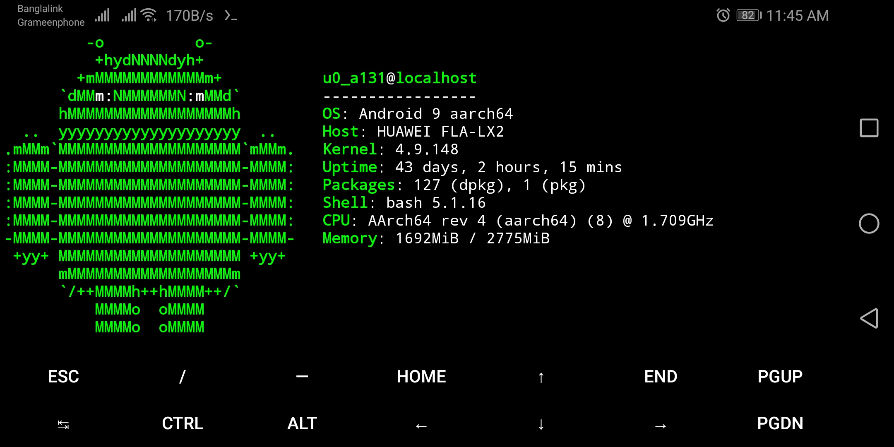
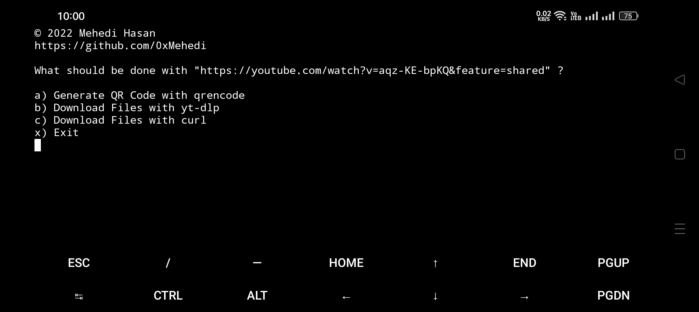
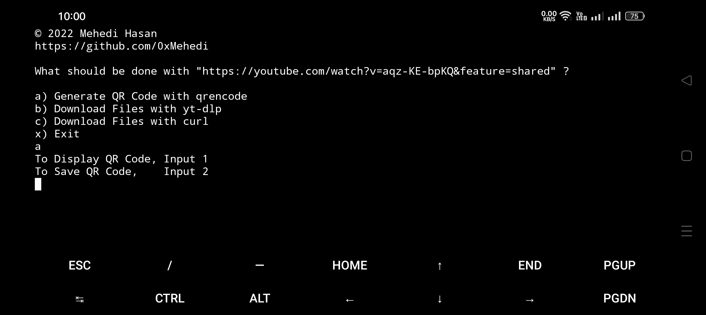
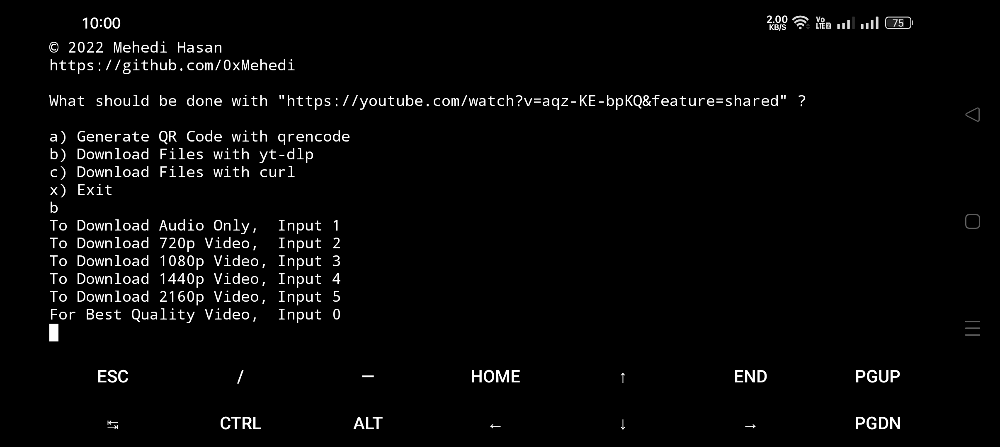

<!-- cspell:words Mehedi Hasan libqrencode mandoc neofetch ohmybash qrencode termux toolset -->

# Termux Spice

_Termux Spice_ is a bundle of scripts to quickly install and configure preselected packages for Termux.

## Authors

Mehedi Hasan (@0xMehedi) and the [contributors](https://github.com/0xMehedi/termux-spice/graphs/contributors).

## Features

_Termux Spice_ installs / configures the following packages:

| Packages            | Description                                                                              |
| :------------------ | :--------------------------------------------------------------------------------------- |
| ffmpeg              | Tools and libraries to manipulate a wide range of multimedia formats and protocols       |
| git                 | Fast, scalable, distributed revision control system                                      |
| gnupg               | Implementation of the OpenPGP standard for encrypting and signing data and communication |
| libqrencode         | Fast and compact library for encoding data in a QR Code symbol                           |
| man                 | Man page viewer from the mandoc toolset                                                  |
| nano                | Small, free and friendly text editor                                                     |
| neofetch            | Simple system information script                                                         |
| openssh             | Secure shell for logging into a remote machine                                           |
| openssh-sftp-server | OpenSSH SFTP server subsystem                                                            |
| python              | Python 3 programming language intended to enable clear programs                          |
| tree                | Recursive directory lister producing a depth indented listing of files                   |
| yt-dlp              | A youtube-dl fork with additional features and patches                                   |
| ohmybash            | A delightful community-driven framework for managing your bash configuration             |

## Screenshots







## Installation

Run the following commands one at a time in the terminal to install _Termux Spice_:

```shell
pkg install -y curl
```

```shell
sh -c "$(curl -fsSL https://raw.githubusercontent.com/0xMehedi/termux-spice/main/install.sh)"
```

## Contributing

Contributions are always welcome.

Check out the [Contribution Guide](./CONTRIBUTING.md) for more info.

## Support

Feel free to [open an issue](https://github.com/0xMehedi/termux-spice/issues/new/choose) if you encounter any problem related to _Termux Spice_.

## License

_Termux Spice_ is released under the [MIT License](./LICENSE).

## Appendix

Built with :heart: in Bangladesh.
