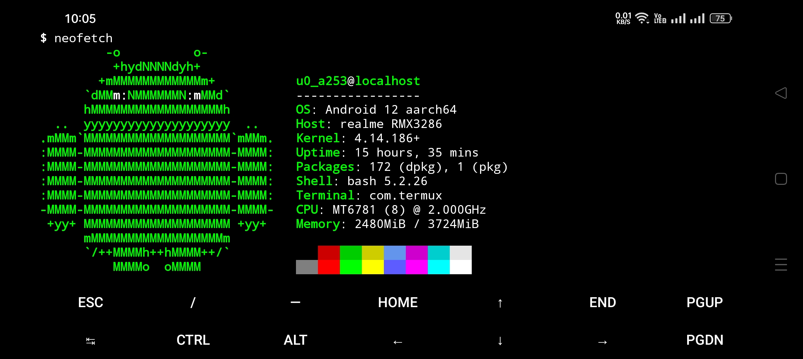

<!-- cspell:words Mehedi Hasan neofetch ohmybash termux -->

# Termux Spice

_Termux Spice_ is a bundle of scripts to quickly install and configure preselected packages for Termux.

## Authors

Mehedi Hasan (@0xMehedi) and the [contributors](https://github.com/0xMehedi/termux-spice/graphs/contributors).

## Features

_Termux Spice_ installs / configures the following packages:

| Packages            | Description                                                                  |
| :------------------ | :--------------------------------------------------------------------------- |
| ffmpeg              | A very fast video and audio converter                                        |
| git                 | A fast, scalable, distributed revision control system                        |
| gnupg               | A set of programs for public key encryption and digital signatures           |
| man                 | The man utility to display the manual pages entitled name                    |
| nano                | A small and friendly editor                                                  |
| neofetch            | A CLI system information tool written in Bash                                |
| openssh             | Secure shell for logging into a remote machine                               |
| openssh-sftp-server | OpenSSH SFTP server subsystem                                                |
| python              | An interpreted, interactive, object-oriented programming language            |
| tree                | A recursive directory listing program                                        |
| yt-dlp              | A program to download videos from YouTube and a few more sites               |
| ohmybash            | A delightful community-driven framework for managing your bash configuration |

## Screenshots



## Installation

Run the following commands one at a time in the terminal to install _Termux Spice_:

```shell
pkg install -y curl
```

```shell
sh -c "$(curl -fsSL https://raw.githubusercontent.com/0xMehedi/termux-spice/main/install.sh)"
```

## Contributing

Contributions are always welcome.

Check out the [Contribution Guide](./CONTRIBUTING.md) for more info.

## Support

Feel free to [open an issue](https://github.com/0xMehedi/termux-spice/issues/new/choose) if you encounter any problem related to _Termux Spice_.

## License

_Termux Spice_ is released under the [MIT License](./LICENSE).

## Appendix

Built with :heart: in Bangladesh.
